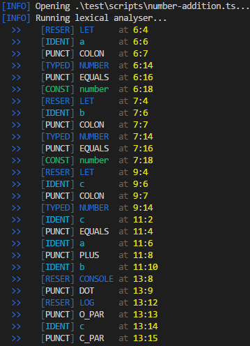

# Lexical Analyser
The lexical analyser converts characters from the source file into tokens. This gives the
compiler an understanding of what is inside the source file.

The Token type is a global class, declared as shown in Figure 8, where location
tracks the line number and character number of the Token.

```ts
    class Token {
        type: Type
        name: string
        lexeme: string
        location: SourcePos
    }
```
*Figure 8. Token Class*

The lexical analyser works by opening a given file, converting it into an array of
characters and attempting to generate a Token from each character, based on definitions in
A2.2. types.ts. Once the end of file is reached, it returns the resulting array of Tokens.
When a character is first read in, it will undergo multiple checks to filter out reserved
characters before handing it over to the word reader, which recognises keywords and
identifiers.

If the character reader encounters line or block comments, it will skip to the line end
or end of block respectively. The lexical analyser does not generate Tokens for whitespace
and effectively ignores it, however it effectively uses that in combination with punctuation to
tell words apart.

If the character reader encounters a single or double quote symbol, it will attempt to
read in a string constant. Otherwise, if it sees any other type of punctuation, it will recognise
it and return a Token.

Once all these tests are finished, the (un)changed character is passed to the word
reader.

Example runs of the lexical analyser and its tokens can be seen in
Figure 9 and Figure 10.


*Figure 9. Lexical Analysis of A1.1. hello-world.ts*



*Figure 10. Lexical Analysis of A1.2. number-addition.ts*
