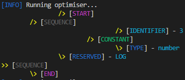
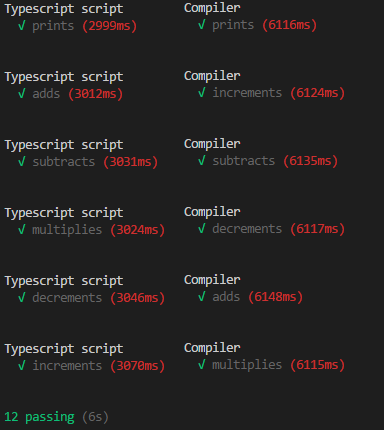

# Optimiser

The optimiser uses the syntax tree generated by the parser and prunes redundant
parts of it. This greatly reduces the size of the program to be compiled, while achieving the
same result.

In this compiler, the optimisation runs before the target code generation, so the
generated code is optimised. The implemented optimisations include:

* Replacing constant variables with constants – this is done by checking if a variable
is ever reassigned. If it is not reassigned (i.e. it is a constant), all references to the
variable are replaced with the constant instead.

* Replacing operations on two constants with the result – this is done by checking
arithmetic expressions for having constants as both of the variables. If so, the
operation gets performed during compilation-time.

* Removing unused variables – this is done by checking if a variable is declared but
never used. If this is the case, the declaration is removed.

* Reducing the size of the tree – this is done by reducing the number of sequence
nodes by merging sequence nodes with only one child.

This is done by recursively optimising the syntax tree repeatedly until no more
optimisations are made during a single run. As a result of this amount of heavy optimisation,
all of the sample programs are compiled down to a single print statement.

The optimised version of a previous example can be seen in
Figure 19.



*Figure 19. Optimised Version of Tree in Figure 13 (A1.2. number-addition.ts)*

If the target code generator is given the optimised syntax tree above, the code in
Figure 20 is generated.

```C
 #include <stdio.h>
 int main() {
 printf("%d", 3);
 return 0;
 }
```
*Figure 20. Code Generated from Figure 19 (A1.2. number-addition.ts)*

Finally, running the Mocha test suite on the optimised compiler reveals that all of the
tests defined in the Test Cases section pass, as seen in Figure 21.



*Figure 21. Final Run of Mocha Test Suite (from Test Cases)*