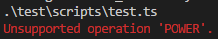

# Parser
The parser takes the lexical analyser’s list of tokens and converts them into an abstract
syntax tree. This gives the compiler an overall view of what the source file is doing.

The SyntaxTree type is also a global class, declared in Figure 11, where content is
a Token. There are two optional variables in the class definition, effectively making up a
binary tree data structure.

```ts
    class SyntaxTree {
        content: Token
        argument1?: SyntaxTree
        argument2?: SyntaxTree
    }
```
*Figure 11. SyntaxTree Class*

The tree is constructed by iterating over every Token and attempting to parse various
expressions. The parser uses pattern matching to detect valid syntax in the previously defined
language.

If it sees the keyword `let`, it will attempt to parse a declaration, which may either be
a normal declaration or a declaration and assignment operation.

If it sees the keyword `console`, it will attempt to parse a standard output operation,
which can either take a variable reference or a constant as the value.

Otherwise, it will attempt to parse an expression, which may be an assignment or
arithmetic operation.

Nodes are added to the syntax tree in such a way that traversing the final tree in order
results in all of the commands being reached in the original order.

Example runs of the parser on previously analysed examples can be seen in Figure 12
and Figure 13.


Figure 12. Running Parser on A1.1. hello-world.ts


Figure 13. Running Parser on A1.2. number-addition.ts


Most of the exceptions are thrown in this stage of the compiler, mostly due to
incorrect or unexpected syntax. It is here that the compiler may be tested for invalid or
otherwise malformed input.


For example, undeclared variables are tested in Figure 14.
```ts
    let a: number = 1
    let b: number = 2
    //let c: number
    c = a + b
    console.log(c)
```


```ts
    let a: number = 1
    //let b: number = 2
    let c: number
    c = a + b
    console.log(c)
 ```


*Figure 14. Testing Undeclared Variables*


Invalid syntax is tested in Figure 15.
```ts
    let a: number = 1
    let b: number = 2
    let c number
    c = a + b
    console.log(c)
```


```ts
    let a: number = 1
    let b: number = 2
    let c: number
    c = a + b
    console.log c
```


*Figure 15. Testing Invalid Syntax*


Unsupported operations are tested in Figure 16.
```ts
    let a: number = 1
    let b: string = "Hello, world!"
    let c: number
    c = a + b
    console.log(c)
```


```ts
    let a: number = 1
    let b: string = 2
    let c: number
    c = a + b
    console.log(c)
```


```ts
    let a: number = 2
    let b: number = 3
    let c: number
    c = a ^ b
    console.log(c)
```



*Figure 16. Testing Unsupported Operations*